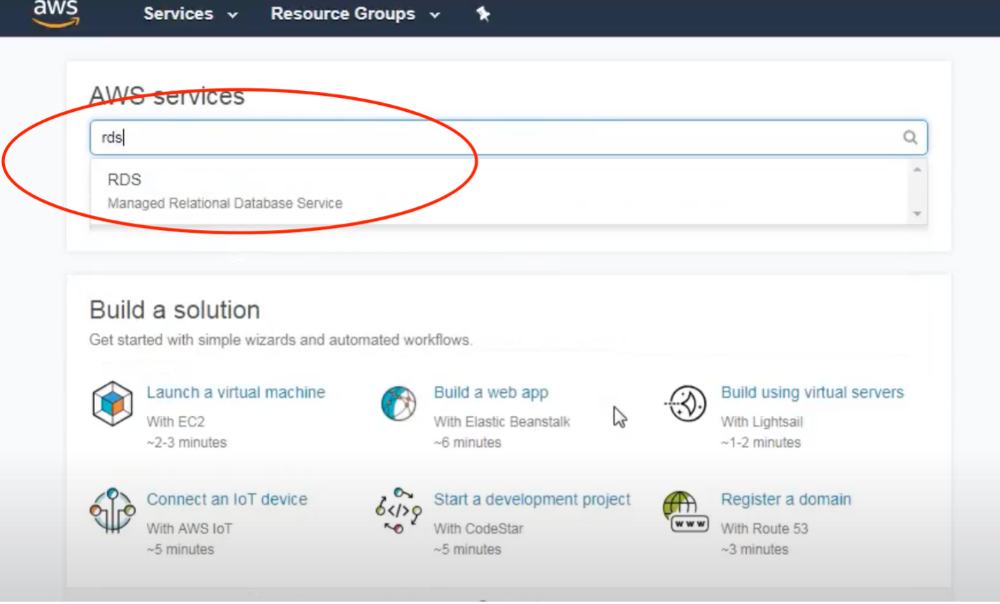

# Setting-up-AWS-RDS
Senior Project

<h1>Setup Amazon Free Tier RDS MySQL Database Instance (db.t2.micro)</h1>

RDS – Amazon Rational Database allows you to do experiment for free.

<h2>Reasons for this decision:</h2>
•	It provides up to 750 hours within available zones.
•	Database engines are MySQL, MariaDB, PostgreSQL, Oracle BYOL and SQL Server.
•	20 GB of General Purpose (SSD) DB Storage.
•	20 GB of backup storage (automatically backups storages if something happens). 

<h2>Steps to setup a RDS DB Instance:</h2>
1.	Sign into your AWS Management Console and search for RDS.
2.	 

2.	Once you find RDS console, open that RDS console page. 

 
3.	After you click on Launch DB instance you will be navigated to these options below. Be mindful of which engine you choose. In this case Amazon Aurora engine is not free. 
 

4.	Next you will see the DB engine you selected along with the license model and DB engine version. It is recommended that you leave these settings at default. 

 
5.	Keep “Storage Type” and “Allocated Storage” as it is.
 

6.	Under “Settings”, enter values for “DB Instance Identifier”, “Master Username”, “Master Password”, and “Confirm Password” then click “Next Step.”
 

7.	In “Network & Security” section keep default setting for all fields.” For “Public accessibility” chick the setting to no for security purposes. 
 

 

8.	In “Database Options” section, enter your database name. If you wish to enable authentication, you are free to do so. Keep default setting for other fields.
Database default port number are based on which engine you selected. For example, 
Aurora/MySQL/MariaDB is 3306, PostgreSQL is 5432, Oracle is 1521, and SQL Server is 433.

 

9.	This section is not available with free tier. 

 

10.	In “Backup” section, set “backup Retention Period” to 0 days otherwise it will charge you.
 
 

After you launch your DB instance you will see this below.

 

After your DB instance is ready you will see this below. You can modify your instances and monitor your usage. 

 
<h2>Reference:</h2>
 https://www.youtube.com/watch?v=UcZOJhi2R5o 

